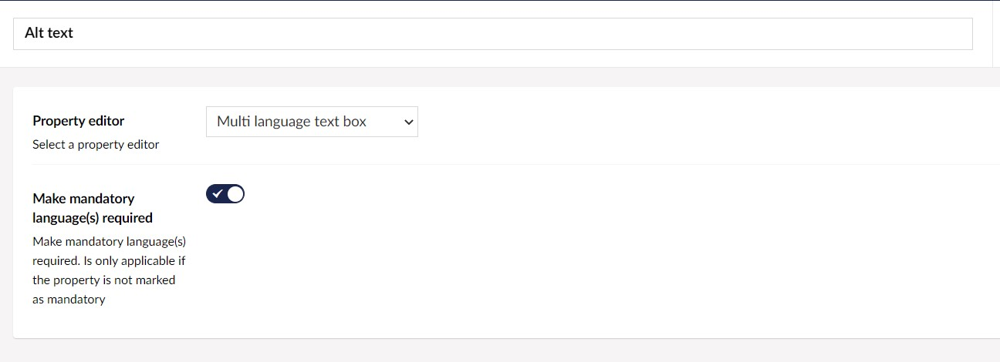
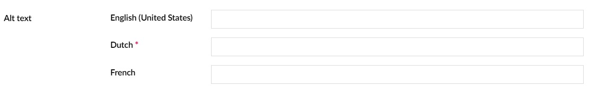

# Multilanguage textbox for Umbraco  

[](https://ci.appveyor.com/project/dawoe/umbraco-multilanguage-textbox)


|NuGet Packages    |Version           |
|:-----------------|:-----------------|
|**Release**|[](https://www.nuget.org/packages/Our.Umbraco.MultiLanguageTextbox)
|**Pre-release**|[](https://www.myget.org/feed/dawoe-umbraco/package/nuget/Our.Umbraco.MultiLanguageTextbox)

|Umbraco Packages  |                  |
|:-----------------|:-----------------|
|**Release**|[](https://our.umbraco.com/packages/backoffice-extensions/multilanguage-textbox/) 
|**Pre-release**| [](https://ci.appveyor.com/project/dawoe/umbraco-multilanguage-textbox/build/artifacts)


## About

This package is useful when you are running a multilingual website and want editors to edit text on a media item in multiple languages. For example the alt text of a image. This will render a input field per configured language in Umbraco. 


## Installation

### Package

Download and install the package from : [https://our.umbraco.com/packages/backoffice-extensions/multilanguage-textbox/](https://our.umbraco.com/packages/backoffice-extensions/multilanguage-textbox/)

### Nuget

`Install-Package Our.Umbraco.MultiLanguageTextbox`

If you only need the binaries you can install

`Install-Package Our.Umbraco.MultiLanguageTextbox.Core`

## Usage

### CMS Configuration

1.  In Umbraco create a datatype and choose Multi language text box as your property editor
2.  If you want to make mandatory languages required you can set this in the datatype configuration. If the property added to a document type or media type is marked as mandatory this is ignored.
    
    1.  Add a property to your document type or media using the newly created datatype
        

### Templates/Views

Getting a value for the property will return you the value entered for the language used for showing the website.

 ```c#
 @Model.Value<string>("propalias")
 ```

Or when you are using Models builder

```C#
@Model.NameOfYourProperty
```

## Changelog

### 12.0.0

Support for Umbraco 12


### 11.0.0

Version compatible with Umbraco 11

### 10.1.0

- Fixes issue #4

### 10.0.0

- Umbraco V10 support
- Converted UI project to razor class library

### 2.2.0

- Make validation of mandatory language work correctly

### 2.1.0

- Fix restore issues on linux

### 2.0.0

- Umbraco V9 support

### 1.0.0

- Initial release


## Contact

Feel free to contact me on twitter : @dawoe21


